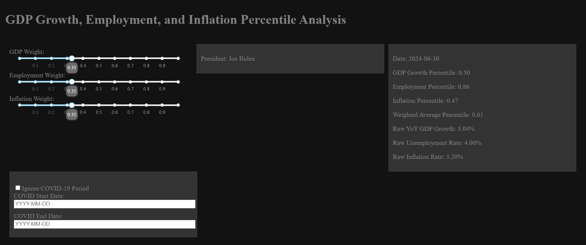
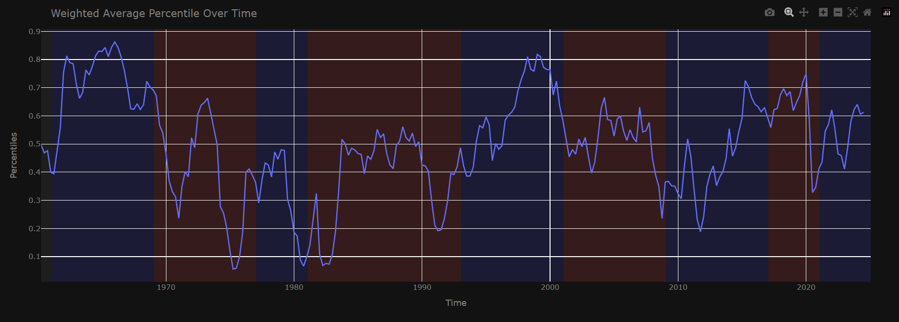
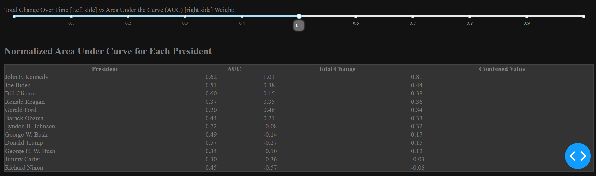

# Presidentomics

The Presidentomics is a presidential economics grading app is an interactive web application designed to evaluate the economic performance of U.S. presidents since 1960. The app compares key economic metrics—GDP growth, unemployment, and inflation—and allows users to dynamically adjust weights for each metric to reflect their own priorities. Users can explore rankings of presidents based on total change in the metrics, area under the curve (AUC) for their tenure, or a combination of both.

## Key Features

### 1. Economic Metric Visualization
- The app visualizes the weighted average percentiles of GDP growth, employment, and inflation over time, giving a clear picture of economic trends during different presidencies.
- Users can adjust weights for GDP growth, employment, and inflation using sliders to create a custom scoring system that reflects their preferences.

### 2. Presidential Rankings
- Rankings are calculated using:
  - **Total Change**: Reflecting the absolute change in the metrics during a president's tenure.
  - **Area Under the Curve (AUC)**: Highlighting sustained performance across their tenure.
  - **Combined Score**: A user-weighted blend of total change and AUC.
- Users can view a sorted table of presidents ranked based on their economic performance according to the selected weights.

### 3. Customization Options
- Users can exclude the COVID-19 period (e.g., 2020-2022) from the analysis to ensure the evaluation isn’t biased by extraordinary circumstances.
- COVID-19 start and end dates are user-defined, allowing flexibility in determining the period to ignore.

### 4. Interactive Data Insights
- The app provides detailed economic data for specific time periods when hovering over the plot, including:
  - Raw GDP growth.
  - Unemployment rate.
  - Inflation rate.
  - Weighted average percentiles.
- Users can see which president was in office during the selected time period.

## How It Works

### Data Sources
The app uses data from the Federal Reserve Bank of St. Louis (FRED):
- **GDP Growth Data**: Annualized year-over-year growth rates.
- **Unemployment Data**: Monthly unemployment rates (U.S. Bureau of Labor Statistics).
- **Inflation Data**: Quarterly average inflation rates.

### Data Processing
1. All data is filtered for the period from 1960 to 2024.
2. Percentile rankings are calculated for each metric.
3. The data is resampled to quarterly frequency and merged into a single dataset for weighted average calculations.

### Dynamic Weight Adjustment
- Weights for GDP growth, employment, and inflation can be adjusted via sliders.
- The app normalizes the weights to ensure they sum to 1.

### Ranking Methodology
- **AUC Calculation**: Uses the trapezoidal rule to compute the area under the curve for the weighted percentile scores during each president's term.
- **Total Change Calculation**: Measures the change in weighted percentiles from the beginning to the end of a president’s term.
- **Combined Score**: Blends AUC and total change based on user-selected weights.

## Getting Started

### Requirements
- Python 3.8+
- Required Python libraries:
  - `pandas`
  - `plotly`
  - `dash`
  - `numpy`

### Setup Instructions
1. Clone this repository.
2. Install the required libraries:
   ```bash
   pip install pandas plotly dash numpy
   ```
3. Place the datasets in the `data` folder:
   - `data/gdp/GDP_Growth_Analysis_Post60.csv`
   - `data/unemployment/UNRATE.csv`
   - `data/inflation/inflation_updated.csv`
4. Run the app:
   ```bash
   python src/presidenteconomics.py
   ```
5. Open the app in your browser at [http://127.0.0.1:8050/](http://127.0.0.1:8050/).

## Usage
1. Adjust the GDP, employment, and inflation weights using the sliders on the left-hand side.
2. Optionally, check the "Ignore COVID-19 Period" box and specify the COVID start and end dates.
3. Explore the time plot for weighted average percentiles.
4. View detailed data and president information by hovering over the plot.
5. Check the ranking table to see how presidents perform based on the selected scoring system.

## Data Files
- **`GDP_Growth_Analysis_Post60.csv`**: Contains year-over-year GDP growth data.
- **`UNRATE.csv`**: Contains monthly unemployment rate data.
- **`inflation_updated.csv`**: Contains quarterly inflation rate data.

## Example Screenshot




## Credits
This project was created to analyze and visualize the economic performance of U.S. presidents in a way that allows users to define their own priorities for evaluating economic outcomes. All data was sourced from the [Federal Reserve Bank of St. Louis (FRED)](https://fred.stlouisfed.org/).

---

For any issues or feature requests, please feel free to create an issue in this repository.
